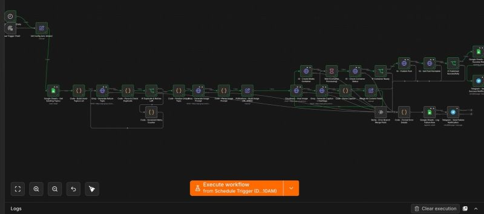
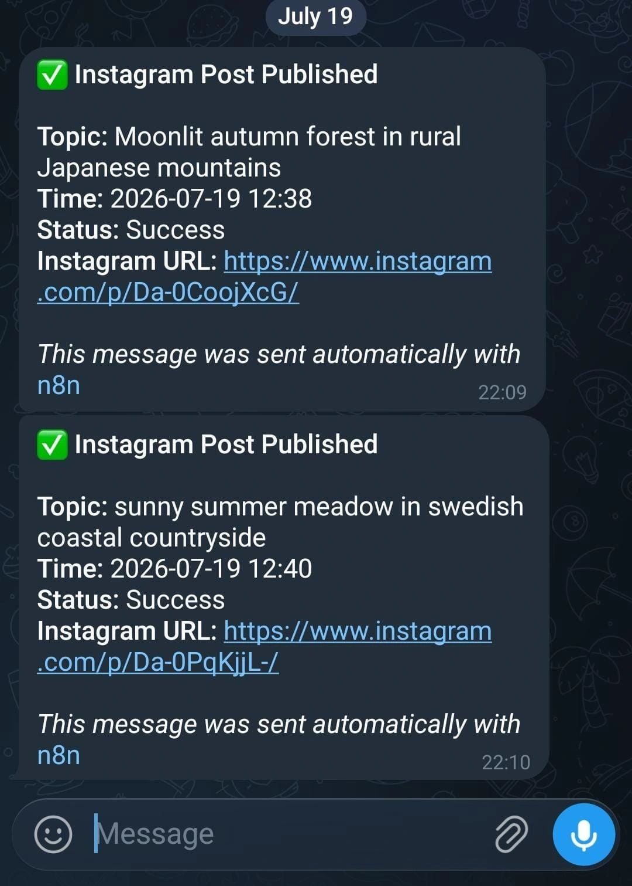

# AutoInstaPost — AI Nature Instagram Automation (n8n)

Fully automated, 100% free pipeline that generates a unique nature topic, writes a cinematic image prompt, renders a photo, hosts it, writes a caption + hashtags, and publishes to Instagram — once a day, with zero manual steps after setup.

```
Schedule/Manual Trigger
  → Config
  → Topic generation (Groq, duplicate-checked against Google Sheets, auto-retries up to 5x)
  → Image prompt (Groq)
  → Image generation (Pollinations AI — free, no key)
  → Image hosting (Cloudinary)
  → Caption + hashtags (Groq)
  → Instagram publish (container → poll status → publish → permalink)
  → Log to Google Sheets (success or failure)
  → Telegram notification (success or failure)
```

## Stack & cost

| Service | Role | Cost |
|---|---|---|
| [Groq](https://console.groq.com) (Llama 3.3 70B) | Topic, image prompt, caption generation | Free |
| [Pollinations AI](https://pollinations.ai) | Image generation | Free, no signup |
| [Cloudinary](https://cloudinary.com) | Image hosting | Free tier |
| [Google Sheets](https://sheets.google.com) | Duplicate-check + audit log | Free |
| [Instagram Graph API](https://developers.facebook.com) | Publishing | Free (Meta developer account) |
| [Telegram](https://core.telegram.org/bots) | Notifications | Free |

No paid API anywhere in this workflow.

## Import

1. Download `AutoInstaPost_v2_production.json` from this repo.
2. n8n → **Workflows → Import from File**.
3. Follow **SETUP.md** to connect all 6 services (credentials + env vars).
4. Run once via **Manual Trigger (Test)** to verify end-to-end before activating the daily schedule.

## 📸 Screenshots

### n8n Workflow



### Instagram Post


### Telegram Notification



## Architecture notes

- **Duplicate-proof topics**: reads full post history from Google Sheets, asks Groq to avoid every past topic, retries up to 5x on collision, then falls back to a date-suffix to guarantee uniqueness.
- **Resilient by default**: every HTTP node has retry (3x) + timeout + a dedicated error output that feeds a single error-formatting node, so failures are always logged to Sheets and alerted via Telegram — nothing fails silently.
- **Empty-sheet safe**: the topic-history read node uses `alwaysOutputData` so a brand-new, empty sheet doesn't stall the whole run on the first execution.
- **Instagram publishing** polls the media container's `status_code` until `FINISHED` instead of a blind fixed wait, so slow-to-process images don't cause premature publish attempts.
- **Config-driven**: every account-specific value (IDs, sheet, chat) lives in one `Init Config` node backed by env vars — cloning this for a second Instagram account means duplicating the workflow and pointing new env vars at it, nothing else changes.

## Environment variables required

```
GROQ_API_KEY=
CLOUDINARY_CLOUD_NAME=
CLOUDINARY_UPLOAD_PRESET=
GOOGLE_SHEET_ID=
GOOGLE_SHEET_TAB=posts
IG_ACCESS_TOKEN=
IG_BUSINESS_ACCOUNT_ID=
TELEGRAM_CHAT_ID=
IG_ACCOUNT_LABEL=nature_page_01
```

Plus two n8n credentials (not env vars): **Google Sheets OAuth2** and **Telegram API**. Full instructions in `SETUP.md`.

## ⚠️ Security note before pushing

Never commit real API keys or access tokens into this repo — this workflow JSON is already sanitized to reference `$env.*` variables only. If you paste real credentials into any node while testing locally, **do not commit that version**; keep a local `.gitignore`'d copy for testing and only push the env-driven version.

## License

Use freely for personal or portfolio projects.
